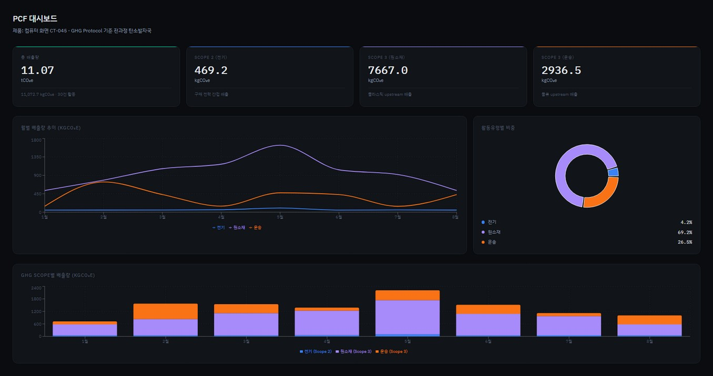
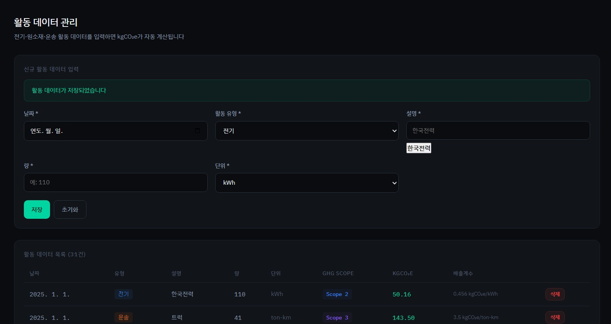
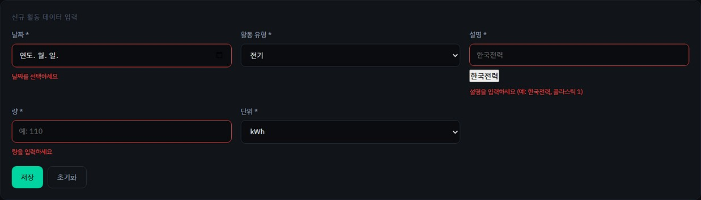

# PCF 대시보드 — CT-045 제품 탄소발자국 관리 플랫폼

> 컴퓨터 화면 CT-045의 제품 탄소발자국(PCF)을 측정·시각화하는 Next.js 대시보드

🔗 **라이브 데모**: https://hanaloop-7ytg.vercel.app

---

## 스크린샷 & 데모 영상

### 데모 영상
[]

### 대시보드


### 활동 데이터 입력 및 목록


### 유효성 검사 에러 메시지


---

## 로컬 실행 방법 (5단계)

```bash
# 1. 저장소 클론
git clone https://github.com/Jonghun-96/hanaloop.git && cd hanaloop

# 2. 환경변수 설정
cp .env.example .env
# .env의 DATABASE_URL, DIRECT_URL을 본인 DB 정보로 수정

# 3. 의존성 설치
yarn

# 4. DB 초기화 + 시드 데이터 투입
yarn db:push && yarn db:seed

# 5. 개발 서버 실행
yarn dev
```

→ http://localhost:3000 에서 확인

**.env 예시**
```
DATABASE_URL="postgresql://postgres:[비밀번호]@[supabase-host]:6543/postgres"
DIRECT_URL="postgresql://postgres:[비밀번호]@[supabase-host]:5432/postgres"
```

---

## 시스템 개요

### 화면 구성

| 화면 | 경로 | 대상 |
|------|------|------|
| PCF 대시보드 | `/` | 경영자: tCO₂e 총량, 월별 추이, 유형별 비중 |
| 활동 데이터 관리 | `/activities` | 실무자: 데이터 입력·조회·삭제 |
| Excel 임포트 | `/import` | 실무자: xlsx 파일 일괄 업로드 |

### 아키텍처

```
Client (Next.js App Router)
  ├── /                 → page.tsx  → GET /api/pcf
  ├── /activities       → page.tsx  → GET/POST/DELETE /api/activities
  └── /import           → page.tsx  → POST /api/import

API Layer (Next.js Route Handlers)
  ├── /api/activities      → CRUD
  ├── /api/activities/[id] → GET/PUT/DELETE
  ├── /api/pcf             → 집계 요약 (KPI, 월별, Scope별)
  └── /api/import          → Excel 파싱 + bulk insert

Business Logic (src/lib/pcf.ts)
  ├── classifyScope()        → ActivityType → GHGScope
  ├── calculateCO2e()        → amount × factor
  └── calculatePCFSummary()  → 전체 집계

Database (PostgreSQL + Prisma)
  ├── activities        → 활동 데이터
  ├── emission_factors  → 배출계수 (버전 이력)
  └── [enums]           → ActivityType, GHGScope
```

### ERD

```
emission_factors
  id            PK
  activityType  ELECTRICITY | MATERIAL | TRANSPORT
  description
  factor        kgCO₂e per unit
  unit
  source
  validFrom     ← 버전 이력 시작
  validTo       ← null이면 현재 유효

activities
  id            PK
  date
  activityType
  description
  amount
  unit
  ghgScope      SCOPE_1 | SCOPE_2 | SCOPE_3
  emissionFactorId  FK → emission_factors.id
  co2e          ← 계산값 (amount × factor)
  createdAt / updatedAt
```

---

## 설계 결정 및 Trade-off

### 1. 배출계수를 별도 테이블로 분리한 이유

**결정**: `EmissionFactor` 테이블 + `validFrom/validTo` 버전 이력 관리

**이유**: 배출계수는 국가 고시 개정(한국전력 기본값은 매년 변경)이나 IPCC 가이드라인 업데이트로 주기적으로 바뀝니다. 계수를 상수로 하드코딩하면 "과거 계산 결과"를 재현할 수 없고, 이력 감사(audit)가 불가능합니다.

`activities.emissionFactorId`로 참조를 유지하면 "이 활동은 2024년 계수 0.456으로 계산됐다"는 사실을 영속적으로 추적할 수 있습니다.

**Trade-off**: 구현이 복잡해지고, 활동 등록 시 "현재 유효한 계수 조회" 로직이 필요합니다. 단순 MVP에서는 과도할 수 있으나 실무 탄소회계 시스템에서는 필수 요구사항입니다.

### 2. PCF API를 단일 엔드포인트로 설계한 이유

**결정**: `GET /api/pcf` 하나에서 KPI·월별·Scope별 데이터를 모두 반환

**이유**: 대시보드는 페이지 로드 시 모든 집계가 한 번에 필요합니다. 엔드포인트를 분리하면 네트워크 왕복(round-trip)이 늘어납니다.

**Trade-off**: 응답 페이로드가 커지고, 일부 데이터만 필요한 화면에서 낭비가 생깁니다. 데이터가 커지면 `?include=monthly,byScope` 같은 필드 선택 기능을 추가하거나, 화면별로 분리하는 방향으로 확장할 수 있습니다.

### 3. GHG Scope 자동 분류 로직

GHG Protocol 기준:
- `ELECTRICITY` → **Scope 2**: 구매한 전기는 발전소에서 배출되는 간접 배출
- `MATERIAL` → **Scope 3 (upstream)**: 원소재 제조 과정의 배출
- `TRANSPORT` → **Scope 3 (upstream)**: 외주 물류의 배출

Scope 1(직접 배출: 자체 연료 연소)은 이번 데이터에 해당 항목이 없어 현재 미구현입니다.

---

## AI 도구 사용 내역

| 단계 | 사용 도구 | 활용 내용 | 프롬프트 요약 |
|------|----------|----------|--------------|
| 설계 | Claude | 전체 아키텍처, DB 스키마, 파일 구조 설계 | "GHG Protocol 기반 PCF 대시보드, Next.js + Prisma + PostgreSQL, 배출계수 버전 이력 포함한 스키마 설계" |
| 구현 | Claude | 코드 생성 전체 | "pcf.ts 계산 로직, API route, 대시보드 UI 컴포넌트" |
| 검토 | 직접 | 계산 공식 검증, 단위 확인, DB 연결 디버깅 | — |

**직접 결정한 사항**: GHG Scope 분류 기준, 배출계수 버전 관리 방식, 단일 PCF API 설계, Supabase 연결 방식

**AI가 생성했으나 내가 검토한 사항**: calculatePCFSummary의 월별 집계 로직, Prisma 싱글톤 패턴

---

## 작업 소요 시간

| 작업 | 소요 시간 |
|------|----------|
| 도메인 학습 (GHG Protocol, PCF) | 1.5시간 |
| DB 스키마 설계 | 0.5시간 |
| API 구현 | 1.5시간 |
| 프론트엔드 UI | 2시간 |
| Excel 임포트 | 1시간 |
| 배포 (Supabase + Vercel) | 1시간 |
| README + 정리 | 0.5시간 |
| **합계** | **~8시간** |

---

## 기술 스택

- **Framework**: Next.js 14 (App Router)
- **Language**: TypeScript
- **ORM**: Prisma
- **DB**: PostgreSQL (Supabase)
- **Charts**: Recharts
- **Excel**: xlsx (SheetJS)
- **배포**: Vercel

